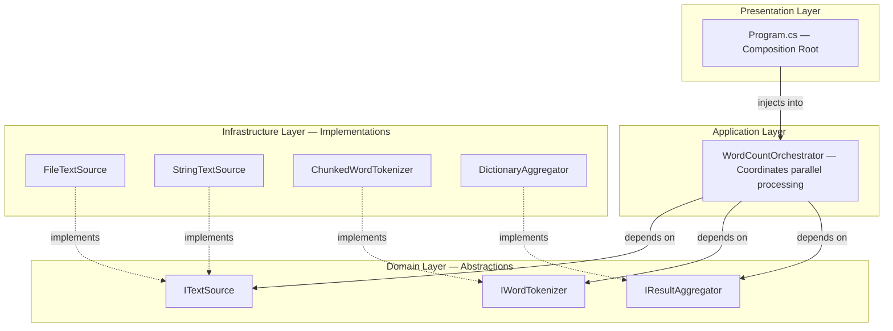
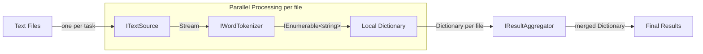
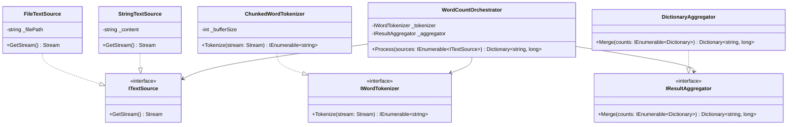
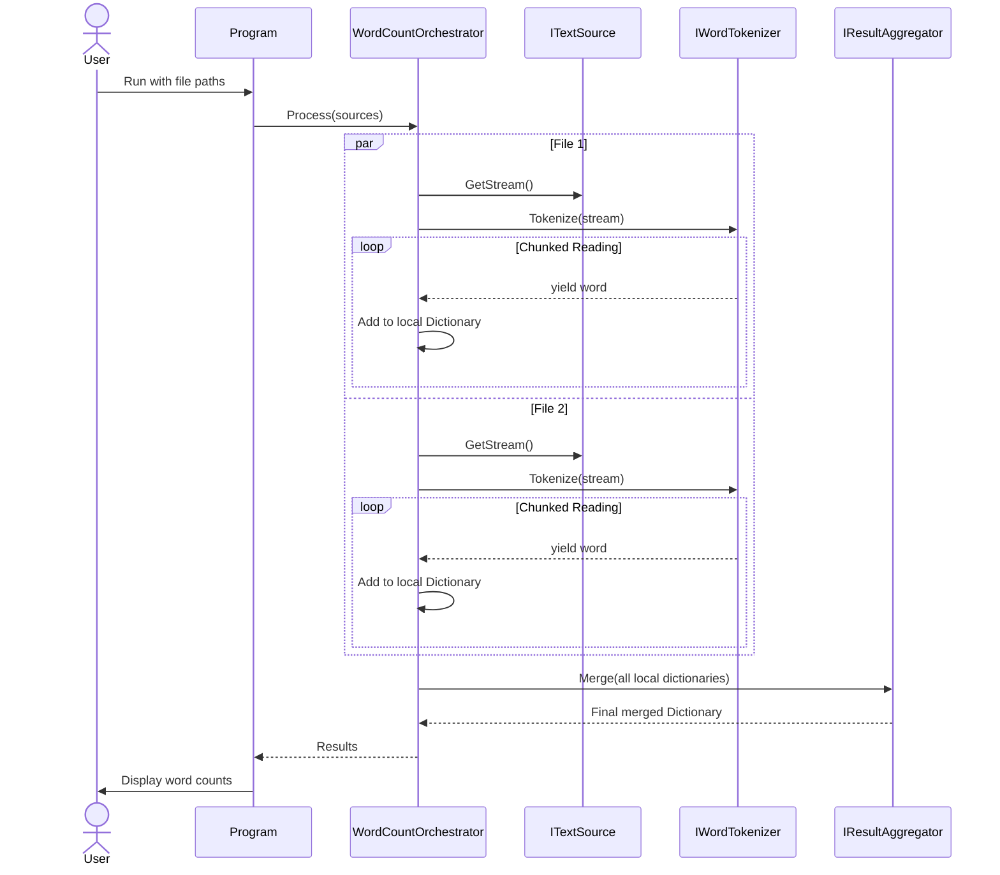
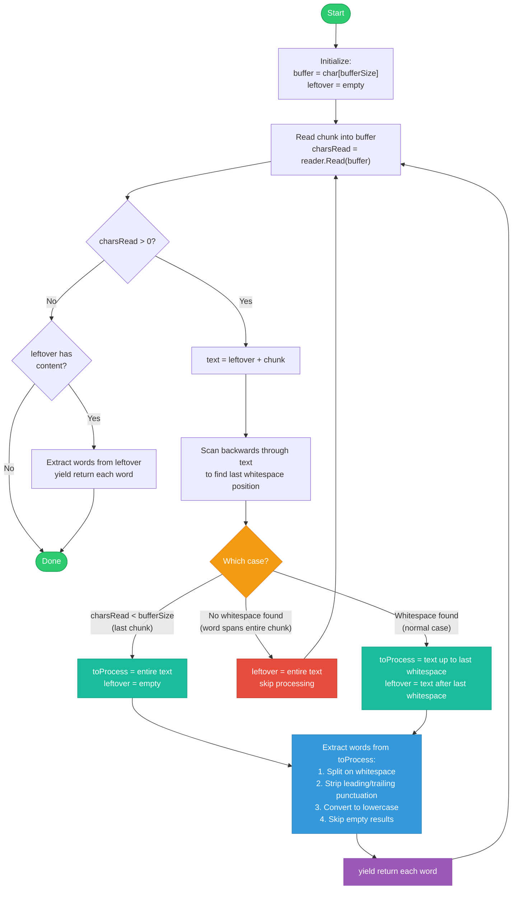

# Word Frequency Counter

A C# console application that counts the occurrences of each unique word across multiple text files and aggregates the results. Designed with clean architecture principles, optimized for large files and parallel processing.

Built with .NET 9 and xUnit.

## Usage

```bash
dotnet run --project WordCounter -- <file1> <file2> ...
```

Example:

```bash
dotnet run --project WordCounter -- file1.txt file2.txt
```

Output:

```
do: 3
well: 2
that: 2
go: 1
and: 1
...
```

## Build and Test

```bash
dotnet build
dotnet test
```

## Architecture

The project follows Clean Architecture with clear separation of concerns:

```
WordCounter/
├── Domain/           Interfaces (abstractions with no dependencies)
├── Application/      Orchestration (coordinates the pipeline)
├── Infrastructure/   Concrete implementations (file I/O, tokenizing, aggregation)
└── Program.cs        Composition root (wires everything together)
```

### Clean Architecture Layers



### Processing Pipeline



### Class Diagram



### Sequence Diagram



### Chunked Word Tokenization Algorithm



#### Algorithm Summary

The tokenizer reads the stream in fixed-size chunks (default 4096 chars) to maintain constant memory usage regardless of file size. The core challenge is handling words that are split across chunk boundaries.

**Three cases on each chunk read:**

1. **Last chunk** (charsRead < bufferSize): Process everything remaining, including any leftover from previous chunks
2. **No whitespace found**: The entire chunk is part of one very long word — accumulate it in leftover and continue reading
3. **Normal case**: Split at the last whitespace position — process everything before it, carry over everything after it as leftover for the next chunk

Words are yielded lazily via `yield return`, meaning the consumer processes one word at a time without accumulating them in memory.

## Design Decisions

### Performance: Chunked Buffer Reading

Files are read using a fixed-size buffer (4096 chars) rather than line-by-line or loading entire files into memory. This handles the requirement of files with very long lines (potentially gigabytes on a single line). A word boundary detection mechanism carries over incomplete words across chunk boundaries.

Memory footprint per file: one buffer (~8KB) plus one partial word, regardless of file size.

### Performance: Parallel Map-Reduce

Files are processed in parallel using `Parallel.ForEach`. Each file builds its own local `Dictionary<string, long>` with zero thread contention. After all files are processed, a single aggregation step merges all local dictionaries into the final result.

This approach was chosen over a shared `ConcurrentDictionary` because local dictionaries avoid lock contention on high-frequency words, provide better cache locality per thread, and keep the aggregation logic independently testable.

Parallelism is limited to `Environment.ProcessorCount` to prevent excessive file handle usage.

### Word Normalization

Case-insensitive counting is achieved using `StringComparer.OrdinalIgnoreCase` on all dictionaries, avoiding the cost of creating lowercase string copies for every word. Leading and trailing punctuation is stripped (e.g., `"hello,"` becomes `"hello"`), while internal punctuation is preserved (e.g., `"don't"` stays as `"don't"`, `"self-aware"` stays as `"self-aware"`).

Tokens that consist entirely of punctuation (e.g., `"..."`) are discarded.

### Testability

All core logic is tested without touching the file system. `StringTextSource` provides an in-memory implementation of `ITextSource`, allowing the entire pipeline to be tested with plain strings. The `ChunkedWordTokenizer` accepts a configurable buffer size, enabling tests that force word splits across chunk boundaries.

### SOLID Principles

- **Single Responsibility**: Each class has one job — reading streams, tokenizing, counting, merging, orchestrating
- **Open/Closed**: New text sources (e.g., HTTP, database) can be added without modifying existing code
- **Liskov Substitution**: `FileTextSource` and `StringTextSource` are interchangeable wherever `ITextSource` is expected
- **Interface Segregation**: Each interface defines a single focused contract
- **Dependency Inversion**: The orchestrator depends on abstractions, not concrete implementations. Only `Program.cs` knows about concrete types

## Assumptions

- Input files are UTF-8 encoded text
- Words are delimited by whitespace characters (spaces, tabs, newlines)
- Word comparison is case-insensitive
- Leading and trailing punctuation is stripped; internal punctuation is preserved
- `long` is used for counts to handle extremely large files where counts could exceed `int.MaxValue`
